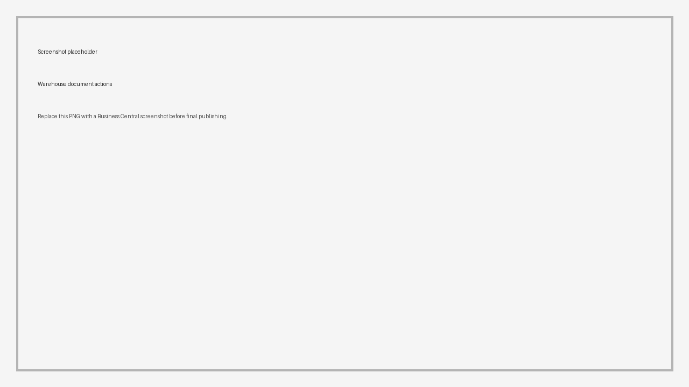

# Warehouse Documents

Use **Create Warehouse Documents** when warehouse work should be created from a Transport Order.

Shipper TMS can create:

- warehouse shipments for source lines that require shipment handling,
- warehouse receipts for source lines that require receipt handling.

## Before you start

1. The Transport Order must be **Released**.
2. The order must contain Transport Requests.
3. Source documents must be eligible for warehouse shipment or receipt creation.
4. Business Central warehouse setup must require warehouse documents for the relevant location.

## Supported source lines

Shipper TMS creates warehouse documents for supported sales and purchase source lines.

| Result | Supported source lines |
|---|---|
| Warehouse Shipment | Sales Order, Purchase Return Order |
| Warehouse Receipt | Purchase Order, Sales Return Order |

Transfer lines are not created as warehouse documents by this action in the current version.

In the current version, return-order warehouse document creation depends on the current warehouse creation logic:

- Purchase Return Order lines are processed for Warehouse Shipment only when the Transport Request also contains at least one eligible Sales Order line.
- Sales Return Order lines are processed for Warehouse Receipt only when the Transport Request also contains at least one eligible Purchase Order line.

If you need standalone return-order warehouse document creation, verify the behavior in a sandbox before using this workflow in production.

## Create warehouse documents

1. Open the [Transport Order](transportorder.md).
2. Confirm the order status is **Released**.
3. Choose **Create Warehouse Documents**.
4. Confirm the action.
5. Open **Show Warehouse Shipments** or **Show Warehouse Receipts**.
6. Process the warehouse documents according to your warehouse workflow.

Expected result:

- Warehouse shipments are created for eligible outbound source lines when the loading location requires shipment handling.
- Warehouse receipts are created for eligible inbound source lines when the unloading location requires receipt handling.
- If documents already exist, Shipper TMS opens the existing documents instead of creating duplicates.

## What the warehouse user sees

After the action succeeds, warehouse users continue in standard Business Central warehouse pages:

| Created document | Warehouse user does next |
|---|---|
| **Warehouse Shipment** | Pick, pack, and ship the outbound goods according to the warehouse process |
| **Warehouse Receipt** | Receive and put away inbound goods according to the warehouse process |

The Transport Order remains the transportation document. The warehouse shipment or receipt remains the warehouse execution document.

## What happens if documents already exist

If warehouse documents already exist, Shipper TMS opens the existing documents instead of creating duplicates.

The same applies when posted warehouse shipment or receipt records already exist for the Transport Order.

## Troubleshooting

| Problem | What to check |
|---|---|
| **Create Warehouse Documents** is unavailable | The Transport Order must be **Released**. |
| No shipment is created | The shipper must be a location that requires shipment handling, and the source line must still be eligible for warehouse shipment. |
| No receipt is created | The consignee must be a location that requires receive handling, and the source line must still be eligible for warehouse receipt. |
| A transfer line does not create a warehouse document | Transfer warehouse document creation is not implemented by this action in the current version. |
| Existing documents open instead of new ones | A warehouse or posted warehouse document is already linked to the Transport Order. |
| Quantities are lower than expected | Business Central warehouse logic uses outstanding warehouse quantities, not the original source quantity. |

## Related

- [Transport Order](transportorder.md)
- [Source Documents](source-documents.md)
- [Reports and Documents](reports.md)
